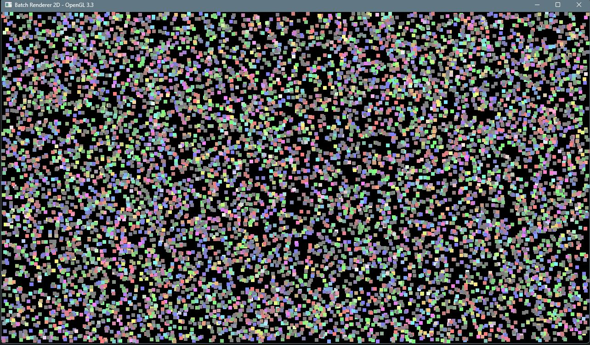

## Simple 2D Batch Renderer



This is a super simple 2D batch renderer using OpenGL 3.3.

You can build it yourself using Windows. Just set the correct path to your MSVC in the env.bat and also change the substitute directory path and run it to setup the environment.

```
@echo off
subst w: Path\To\This\Repository
call "C:\Program Files\Microsoft Visual Studio\2022\Community\VC\Auxiliary\Build\vcvars64.bat"
```

You also need to build GLFW first before compiling the batch renderer.

```
w:\scripts\build_glfw.bat
w:\scripts\build.bat
```